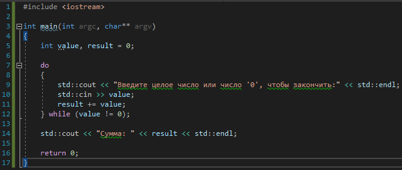

# Задача 2. Сумматор

### Описание
Напишите программу, которая запрашивает у пользователя целые числа до тех пор, пока пользователь не введёт число `0`.

После того, как пользователь ввёл число `0`, программа выводит сумму введённых пользователем чисел и завершает работу.

### Пример работы программы
```
Введите целое число или число '0', чтобы закончить:
13
Введите целое число или число '0', чтобы закончить:
666
Введите целое число или число '0', чтобы закончить:
42
Введите целое число или число '0', чтобы закончить:
0
Сумма: 721
```
#### Подсказки

> Не читайте этот раздел сразу, попытайтесь сначала решить задачу самостоятельно :)

<details>

<summary>Подсказка 1. Что использовать для решения?</summary>

Используйте цикл `do...while` для того, чтобы запрашивать у пользователя числа
Используйте `std::cout` для вывода информации
Используйте `std::cin` непосредственно для запроса значения
Для проверки введённого пользователем значения используйте блок `while` цикла `do...while`

</details>

<details>

<summary>Подсказка 2. Решение</summary>



</details>