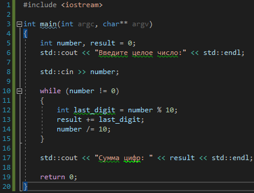

# Задача 2. Сумма цифр числа

### Описание
Напишите программу, которая запрашивает у пользователя целое число и выводит на экран сумму всех его цифр.

### Примеры работы программы
```
Введите целое число:
7345
Сумма цифр: 19
```
```
Введите целое число:
1234
Сумма цифр: 10
```
#### Подсказки

> Не читайте этот раздел сразу, попытайтесь сначала решить задачу самостоятельно :)

<details>

<summary>Подсказка 1. Что использовать для решения?</summary>

Используйте `std::cout` для вывода информации

Используйте `std::cin` непосредственно для запроса значения

Используйте оператор `%` (остаток от деления), чтобы найти остаток от деления на 10. Это будет последняя цифра числа

Используйте оператор `/` (деление), чтобы разделить число на 10 для того, чтобы откинуть последнюю цифру

Используйте цикл `while` для того, чтобы делать вышеперечисленные действия до тех пор, пока ваше число не откинет последнюю цифру и не превратится в 0

</details>

<details>

<summary>Подсказка 2. Решение</summary>



</details>