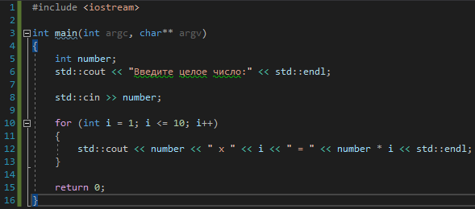

# Задача 3. Таблица умножения для числа

### Описание
Напишите программу, которая запрашивает у пользователя целое число и выводит на экран таблицу умножения для этого числа

### Примеры работы программы
```
Введите целое число:
7
7 x 1 = 7
7 x 2 = 14
7 x 3 = 21
7 x 4 = 28
7 x 5 = 35
7 x 6 = 42
7 x 7 = 49
7 x 8 = 56
7 x 9 = 63
7 x 10 = 70
```
```
Введите целое число:
834
834 x 1 = 834
834 x 2 = 1668
834 x 3 = 2502
834 x 4 = 3336
834 x 5 = 4170
834 x 6 = 5004
834 x 7 = 5838
834 x 8 = 6672
834 x 9 = 7506
834 x 10 = 8340
```
#### Подсказки

> Не читайте этот раздел сразу, попытайтесь сначала решить задачу самостоятельно :)

<details>

<summary>Подсказка 1. Что использовать для решения?</summary>

Используйте `std::cout` для вывода информации

Используйте `std::cin` непосредственно для запроса значения

Используйте цикл `for` для того, чтобы пробегаться по числам от 1 до 10 и выводить каждую следующую строку таблицы умножения

</details>

<details>

<summary>Подсказка 2. Решение</summary>



</details>