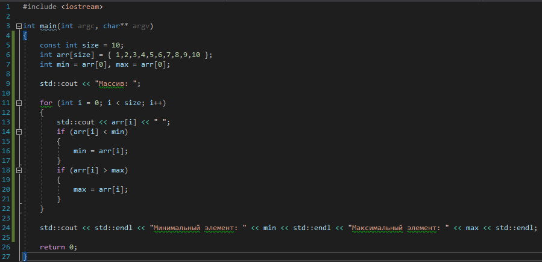

# Задача 2. Максимум и минимум

### Описание
Напишите программу, которая создаёт массив целых чисел на 10 элементов, выводит на экран все элементы массива, находит минимальный и максимальный элементы массива и выводит их на экран. Числа для заполнения массива придумайте сами

### Пример работы программы
```
Массив: 1 2 3 4 5 6 7 8 9 10
Минимальный элемент: 1
Максимальный элемент: 10
```
#### Подсказки

> Не читайте этот раздел сразу, попытайтесь сначала решить задачу самостоятельно :)

<details>

<summary>Подсказка 1. Что использовать для решения?</summary>

Чтобы создать массив целых чисел и сразу его инициализировать, нужно указать тип элементов, имя переменной массива, квадратные скобки и список инициализации

Используйте цикл `for` для перебора элементов массива

Используйте условный оператор `if` и отдельные переменные для хранения минимума и максимума

Используйте первый элемент массива для инициализации переменных минимума и максимума

Используйте `std::cout` для вывода информации

</details>

<details>

<summary>Подсказка 2. Решение</summary>



</details>