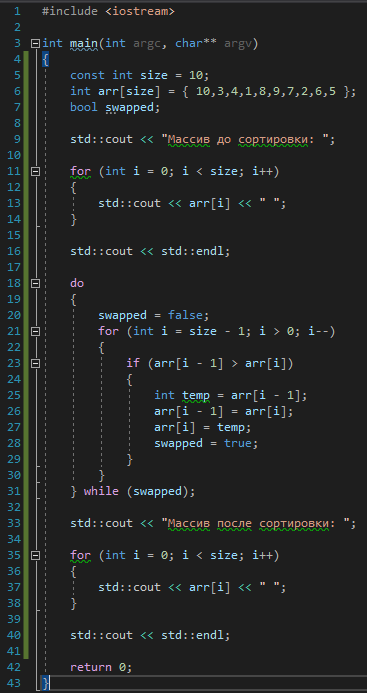

# Задача 4. Обратный пузырёк

### Описание
Напишите программу, которая создаёт и инициализирует неупорядоченный массив целых чисел на 10 элементов и сортирует его пузырьком в обратную сторону.

В обычной сортировке пузырьком после первой итерации самый большой элемент массива оказывается в конце массива, после второй итерации самый второй по максимальности значения элемент оказывается в массиве предпоследним и так далее. В самом конце оказывается, что самый маленький элемент массива стоит в начале массива

Сортировка пузырьком в обратную сторону предполагает обратный механизм - после первой итерации самый маленький элемент массива оказывается в начале массива, после второй итерации второй по минимальности элемент оказывается вторым по счёту в массиве и так далее.

На экран необходимо вывести массив до сортировки и массив после сортировки

Числа для заполнения массива придумайте сами

### Пример работы программы
```
Массив до сортировки: 10 3 4 1 8 9 7 2 6 5
Массив после сортировки: 1 2 3 4 5 6 7 8 9 10
```
#### Подсказки

> Не читайте этот раздел сразу, попытайтесь сначала решить задачу самостоятельно :)

<details>

<summary>Подсказка 1. Что использовать для решения?</summary>

Чтобы создать массив целых чисел и сразу его инициализировать, нужно указать тип элементов, имя переменной массива, квадратные скобки и список инициализации

Используйте цикл `do...while` и вложенный цикл `for` для многократного прохода по сортируемому массиву

Для того, чтобы проходить по массиву в обратную сторону, в цикле `for` вы должны уменьшать, а не увеличивать счётчик. Для этого укажите начальным значением индекс последнего элемента массива, в условиях выхода укажите, что счётчик не должен стать меньше 0 (иначе вы выйдете за границы массива), а в действиях после итерации вместо `i++` укажите `i--`

Используйте временную переменную для того, чтобы менять местами элементы массива

</details>

<details>

<summary>Подсказка 2. Решение</summary>



</details>