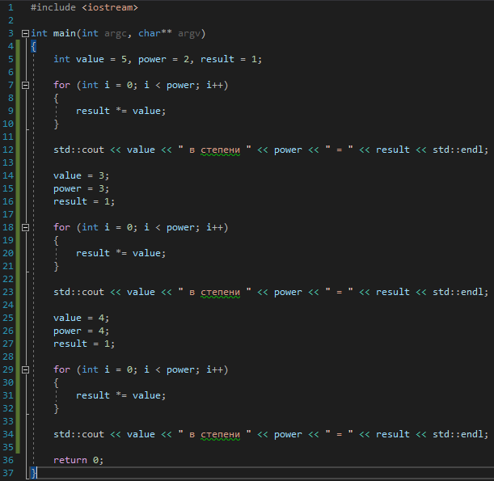

# Задача 2. Устранение дублирования

### Описание
Дана программа:



Определите, что она делает, найдите дублирующийся код. Создайте функцию, которая будет устранять дублирование, и вместо повторяющегося кода вызывайте эту функцию. Результат работы программы не должен измениться

### Пример работы программы
```
5 в степени 2 = 25
3 в степени 3 = 27
4 в степени 4 = 256
```
#### Подсказки

> Не читайте этот раздел сразу, попытайтесь сначала решить задачу самостоятельно :)

<details>

<summary>Подсказка 1. Что использовать для решения?</summary>

Программа содержит три участка повторяющегося кода. Повторяющийся код возводит заданное число в заданную степень. Соответственно, нужно создать функцию, которая будет принимать два параметра - число и степень - и возводить это число в эту степень.

</details>

<details>

<summary>Подсказка 2. Решение</summary>


</details>