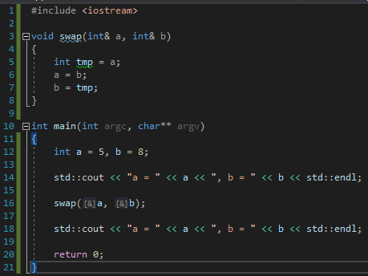

# Задача 2. Обмен значениями

### Описание
В этом задании нам предстоит написать функцию `swap`, которая будет обменивать значения между двумя переменными. Посмотрите вот на этот кусок программы:
```cpp
int main(int argc, char** argv)
{
	int a = 5, b = 8;

	std::cout << "a = " << a << ", b = " << b << std::endl;

	swap(a, b);

	std::cout << "a = " << a << ", b = " << b << std::endl;

	return 0;
}
```

В этой программе используется функция swap, которую нам и предстоит создать. При этом мы должны написать её так, чтобы программа работала следующим образом:

### Пример работы программы
```
a = 5, b = 8
a = 8, b = 5
```
#### Подсказки

> Не читайте этот раздел сразу, попытайтесь сначала решить задачу самостоятельно :)

<details>

<summary>Подсказка 1. Что использовать для решения?</summary>

Для того, чтобы функция `swap` могла изменять значения в тех переменных, которые в неё передали - эти переменные должны быть переданы в функцию по ссылке. Для этого необходимо использовать оператор `&` при объявлении параметров функции

Для вывода на консоль использовать `std::cout`

</details>

<details>

<summary>Подсказка 2. Решение</summary>



</details>