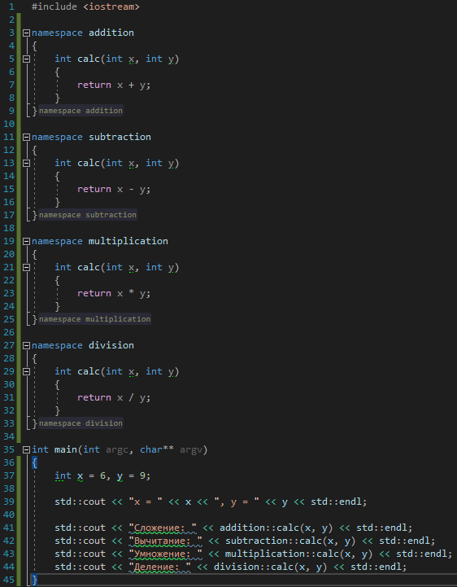

# Задача 2. Одинаковые, но разные функции

### Описание
В этом задании наша задача - создать несколько функций с **одинаковой** сигнатурой (то есть с одинаковым именем, одинаковыми параметрами и одинаковым типом возвращаемого значения), но с разной реализацией

Создайте 4 функции `int calc(int x, int y)`, каждая из которых будет реализовывать одно из четырёх простых арифметических действий (сложение, вычитание, умножение, деление).

В функции `main` напишите код, который использует каждую из четырёх функций и выводит результат на экран. В функции передавайте два числа, которые перед этим тоже выведите на экран, чтобы можно было убедиться в корректности операции

### Пример работы программы
```
x = 6, y = 9
Сложение: 15
Вычитание: -3
Умножение: 54
Деление: 0
```
#### Подсказки

> Не читайте этот раздел сразу, попытайтесь сначала решить задачу самостоятельно :)

<details>

<summary>Подсказка 1. Что использовать для решения?</summary>

Чтобы иметь 4 функции с одинаковой сигнатурой, но с разной реализацией, надо воспользоваться пространствами имён (`namespace`)

Для вывода на консоль использовать `std::cout`

</details>

<details>

<summary>Подсказка 2. Решение</summary>



</details>