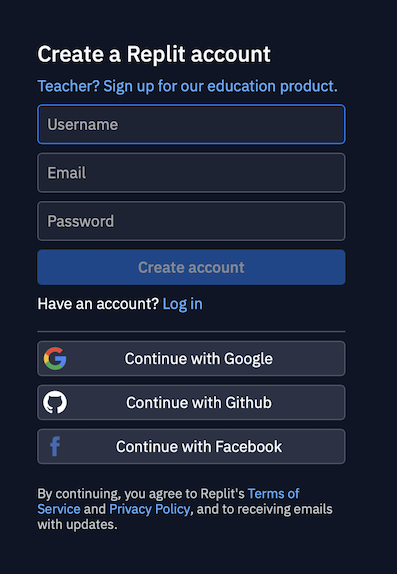
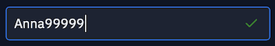
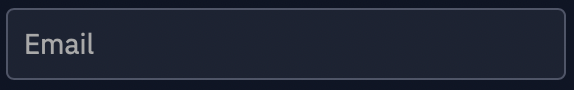
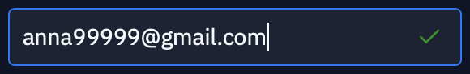
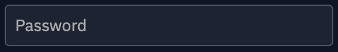
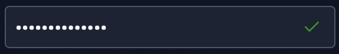
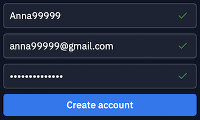
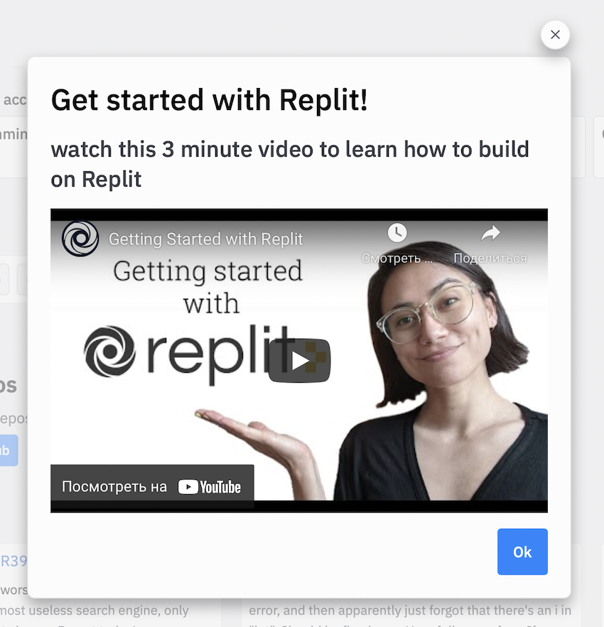
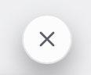

# Инструкция по регистрации на сайте repl.it 

1. Перейдите по ссылке https://replit.com

Вот что вы увидите:

2. В правом верхнем углу нажмите Sign up

3. Появится вот такое окно с полями:

4. В поле Username  впишите ваш логин английскими буквами и/или цифрами.

Логин должен быть уникальным, сайт вам подскажет, что логин корректен, зеленой галочкой

5. В поле Email  введите вашу почту

 
Когда введёте почту, в поле появится зеленая галочка 

6. В поле Password  введите пароль

Пароль должен состоять не менее, чем из 8-ми символов. Также пароль должен содержать английские буквы, символы и цифры.

Вот что вы увидете, если пароль придуман правильно:

7. Так должны выглядеть все поля, если всё верно заполнено: 

8. Теперь нажимаем Create account 

9. Сайт предложит вам посмотреть приветственное видео

Это необязательно. Чтобы закрыть его, нажмите на крестик в правом верхнем углу окна с видео

10. Осталось подтвердить почту. Зайдите в свою почту, найдите письмо от repl.it. И перейдите по ссылке из письма

11. Вы зарегистрированы!
